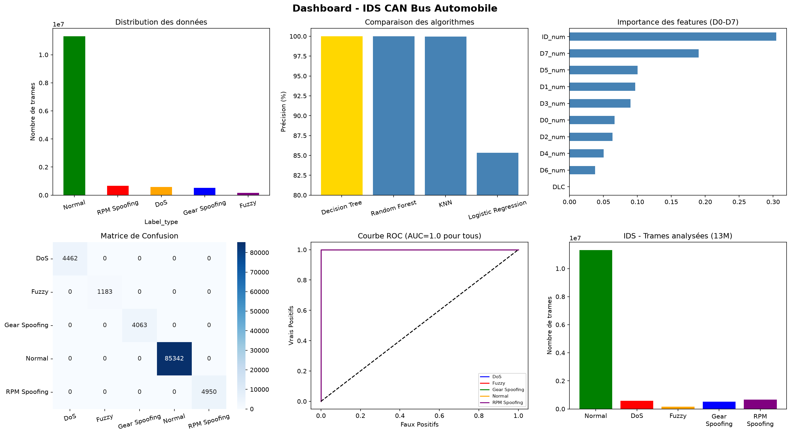
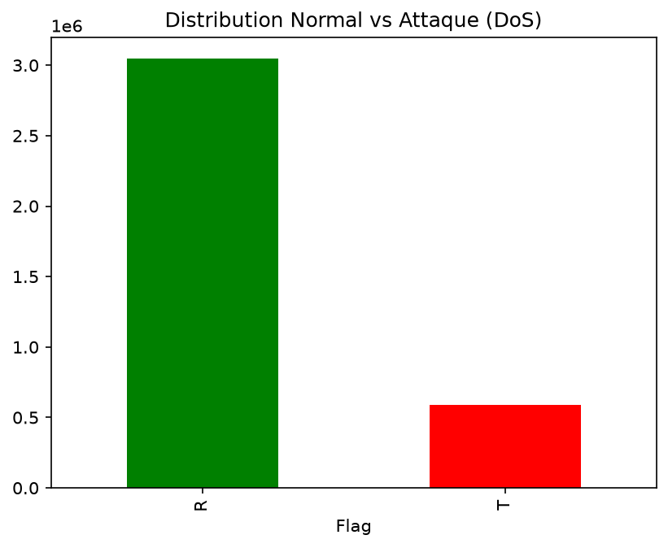
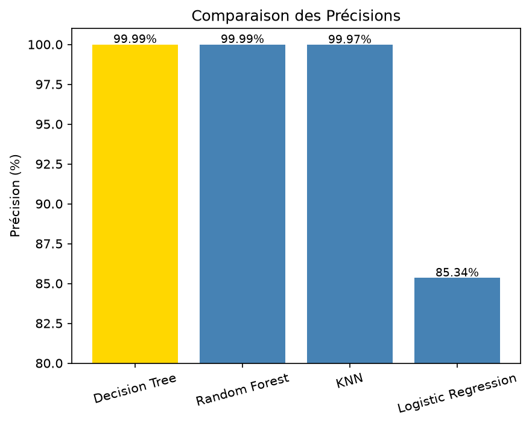
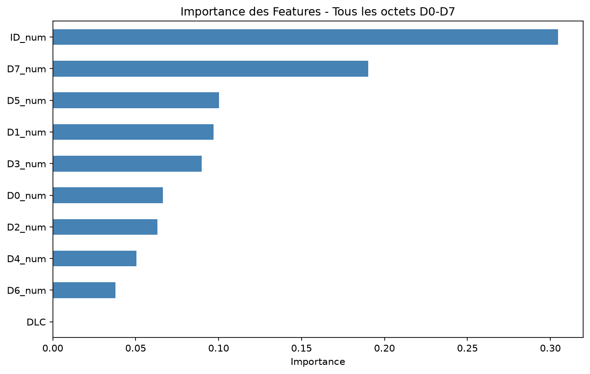
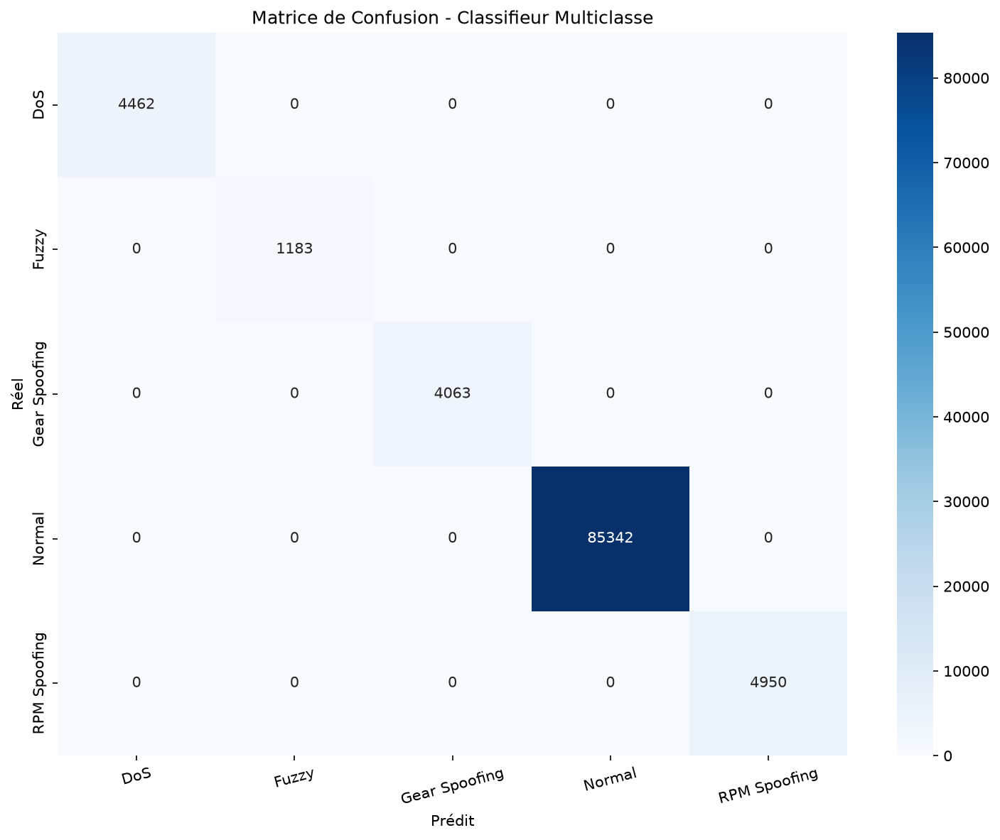
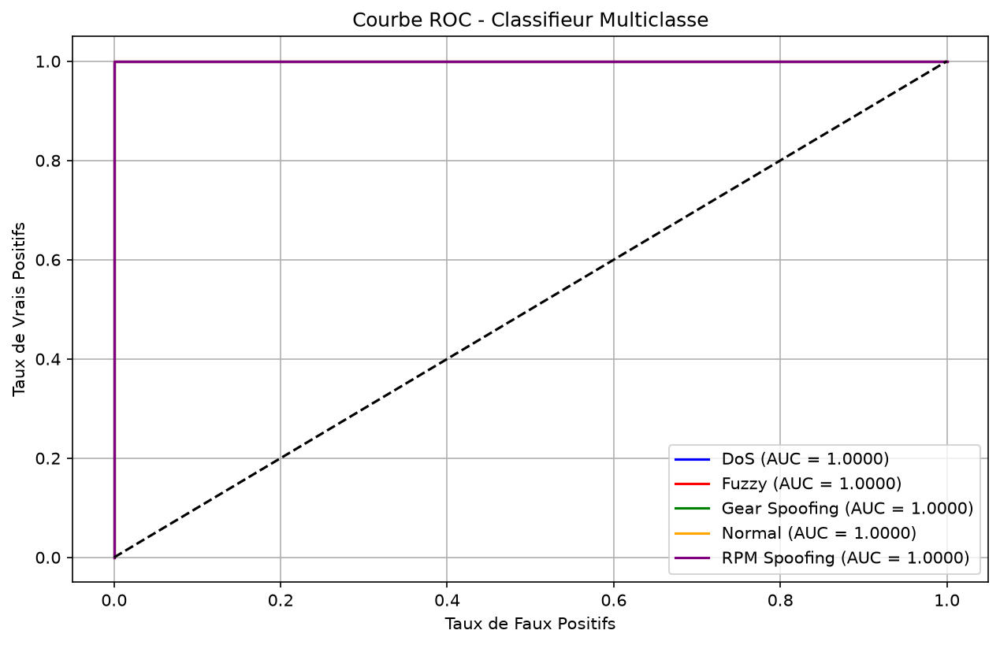
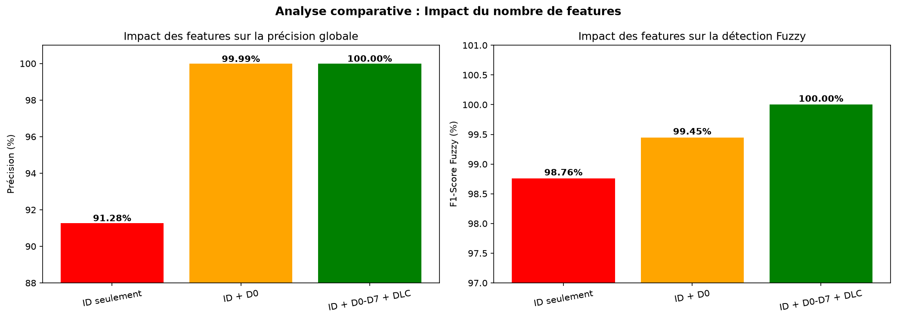

# IDS-CAN-Bus-Automobile
Intrusion Detection System for CAN Bus using Machine Learning
# 🚗 IDS CAN Bus Automobile — Détection d'Intrusions par Machine Learning


## 📋 Description

Ce projet présente un **Système de Détection d'Intrusions (IDS)** pour le protocole **CAN Bus** (Controller Area Network) des véhicules automobiles, basé sur des techniques de **Machine Learning**.

Réalisé dans le cadre d'un stage de fin d'année à **First Concept Distribution** (partenaire de **Stellantis**), ce projet analyse plus de **13 millions de trames CAN** et détecte 4 types d'attaques avec une précision de **100%**.

---

## 🎯 Objectifs

- Analyser la sécurité du protocole CAN Bus
- Identifier les signatures des attaques réseau embarqué
- Concevoir un IDS basé sur le Machine Learning
- Comparer plusieurs algorithmes de classification
- Analyser l'impact du nombre de features (D0-D7)

---

## 🔴 Types d'Attaques Détectées

| Attaque | Description | Signature |
|---|---|---|
| **DoS** | Inondation de messages | ID = 0x0000 |
| **Fuzzy** | IDs aléatoires | ID inconnu |
| **RPM Spoofing** | Falsification régime moteur | ID=0x0316, D0=0x45 |
| **Gear Spoofing** | Falsification rapport vitesse | ID=0x043f, D0=0x01 |

---

## 📊 Dataset

**Car-Hacking Dataset** — HCRL, Korea University

| Type | Trames | Pourcentage |
|---|---|---|
| Normal | 11,315,515 | 85.49% |
| RPM Spoofing | 654,897 | 4.95% |
| DoS | 587,521 | 4.44% |
| Gear Spoofing | 523,629 | 3.96% |
| Fuzzy | 156,085 | 1.18% |
| **Total** | **13,237,647** | **100%** |

📥 **Télécharger le dataset :** [Car-Hacking Dataset sur Kaggle](https://www.kaggle.com/datasets/pranavjha24/car-hacking-dataset)

---

## 🤖 Algorithmes Comparés

| Algorithme | Précision | Temps |
|---|---|---|
| Decision Tree | 99.99% | 0.22s |
| **Random Forest** | **99.99%** | **2.80s** |
| KNN | 99.97% | 0.10s |
| Logistic Regression | 85.34% | 0.37s |

✅ **Random Forest** retenu pour sa robustesse et résistance au surapprentissage.

---

## 🔬 Contribution Originale — Impact des Features D0-D7

| Configuration | Features | Précision | Fuzzy F1 |
|---|---|---|---|
| ID seulement | 1 | 91.28% | 98.76% |
| ID + D0 | 2 | 99.99% | 99.45% |
| **ID + D0-D7 + DLC** | **10** | **100%** | **100%** |

L'analyse complète des octets D0-D7 améliore la détection Fuzzy de **99.45% → 100%**.

---

## 🛡️ IDS Avancé

L'IDS identifie le **type exact** de l'attaque avec un **score de confiance** :
Trame 02 | ID: 043f | D0: 01 | Attaque | Gear Spoofing (100%)
Trame 03 | ID: 0000 | D0: 00 | Attaque | DoS (100%)
Trame 10 | ID: 0316 | D0: 45 | Attaque | RPM Spoofing (100%)

---

## 📈 Résultats



| Métrique | Valeur |
|---|---|
| Précision globale | **100%** |
| Trames analysées | **13,237,647** |
| AUC (Courbe ROC) | **1.0000** |
| Types d'attaques détectés | **4/4** |

---

## 🖼️ Figures

| Figure | Description |
|---|---|
|  | Distribution DoS |
|  | Comparaison algorithmes |
|  | Importance features |
|  | Matrice confusion multiclasse |
|  | Courbe ROC |
|  | Impact features D0-D7 |

---

## 🛠️ Technologies

```python
Python 3.14
Jupyter Notebook
Pandas
Scikit-learn (Random Forest, Decision Tree, KNN, Logistic Regression)
Matplotlib
Seaborn
```

---

## 🚀 Comment utiliser

```bash
# 1. Cloner le repository
git clone https://github.com/bhz468/IDS-CAN-Bus-Automobile.git

# 2. Installer les dépendances
pip install pandas scikit-learn matplotlib seaborn jupyter

# 3. Télécharger le dataset depuis Kaggle
# https://www.kaggle.com/datasets/pranavjha24/car-hacking-dataset

# 4. Lancer Jupyter
jupyter notebook IDS_CAN_Bus.ipynb
```

---

## 📁 Structure du Projet
IDS-CAN-Bus-Automobile/
│
├── IDS_CAN_Bus.ipynb          # Notebook principal
├── dashboard_ids_canbus.png   # Dashboard récapitulatif
├── feature_impact.png         # Analyse impact features
├── fig1_distribution_dos.png  # Distribution DoS
├── fig2_distribution_fuzzy.png
├── fig3_confusion_dos.png
├── fig4_comparaison_algorithmes.png
├── fig5_importance_features.png
├── fig6_confusion_multiclasse.png
├── fig7_courbe_roc.png
├── fig8_distribution_rpm.png
├── fig9_distribution_gear.png
├── fig10_confusion_fuzzy.png
├── fig11_confusion_rpm.png
├── fig12_confusion_gear.png
└── README.md

---

## 📚 Références

1. Kang & Kang (2016) — *Intrusion detection system using deep neural network for in-vehicle network security*
2. Song et al. (2020) — *Intrusion detection system based on CAN messages*
3. Breiman (2001) — *Random Forests*
4. HCRL Korea University — *Car-Hacking Dataset*
